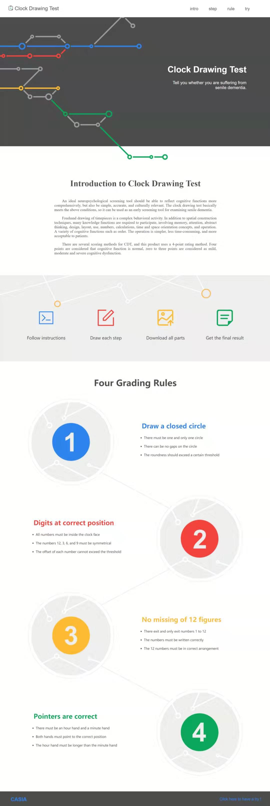

# Clock Drawing Test

This is a [Clock Drawing Test](https://en.wikipedia.org/wiki/Executive_dysfunction#Clock_drawing_test) scoring system implemented with html, css, javascript and python, which is based on ajax + django design framework and mvc design pattern.

## Introduction

The clock test is a simple, high-accuracy and culturally relevant deafness screening test that comprehensively reflects cognitive function, and can be used as an early screening tool for examining senile dementia.

Freehand drawing of timepieces is a complex behavioral activity. In addition to spatial construction techniques, many knowledge functions are required to participate, involving memory, attention, abstract thinking, design, layout, use, numbers, calculations, time and space orientation concepts, and operation order. In all, A variety of cognitive functions are in need.

The clock test has a variety of score tables. The system uses a 4-point system, which are:

- A closed circle

- Scales located inside the circle and evenly distributed

- Numbers evenly distributed in the circle and arranged in 1 - 12 order

- The hour and minute hands pointing to the correct time (specified by the tester)

## Dependencies

- [OpenCV](https://opencv.org/) :

`pip install opencv-python`

- [Numpy](https://numpy.org/) :

`pip install numpy`

- [Django](https://www.djangoproject.com/) :

`pip install Django`

Make sure you can run the following statements in your Python 3 shell:

```
import numpy
import cv2
import django
```

## Using Method

- Config the dependencies in need

You should make sure having installed python3, django, opencv and numpy.

- Download this repo

One way, download this repo directly, the other, use the command : ```django-admin startproject CDT``` to build a django project and copy all folers and files into it.

! Note : Don't forget to copy the backend part [https://github.com/SPiCaRiA/Clock-Drawing-Test](https://github.com/SPiCaRiA/Clock-Drawing-Test) to the judge folder.

- Enter the follow command in cmd

```python manage.py runserver 0.0.0.0:8000``` to start the local server.

- Start project in browser

Enter ```127.0.0.1:8000/index/``` in the address bar of the browser, and the index page will be shown. It is the introduction on this product.



- Use the testing system

Click the try part you will turn to the sketch page, which is a drawing board, just follow the command to draw will get the final result.


## <span id="design">Design Idea</span>

The whole part adopt MVC design pattern. This repo just implements view and controler. First let's have a look at the structure of the catalog.

```
- CDT
    - __init__.py
    - settings.py
    - urls.py
    - view.py
    - wsgi.py
- data
- judge
- static
    - css
        - index.css
        - sketch.css
    - img
        - bin_select.png
        - bin.png
        - eraser_select.png
        - eraser.png
        - index.png
        - next_select.png
        - next.png
        - pen_select.png
        - pen.png
        - rule_one.png
        - rule_two.png
        - rule_three.png
        - rule_four.png
        - step_one.png
        - step_two.png
        - step_three.png
        - step_four.png
        - symbol.png
    - js
        - index.js
        - jquery-3.4.1.min.js
        - sketch.js
- template
    - index.html
    - sketch.html
- manage.py
```

The CDT folder is the framework of this project. [\_\_init__.py](CDT/__init__.py) makes others recognise this as a package. [settings.py](CDT/settings.py) defines the basic path of template pages, static files including images, css, js and so on. [urls.py](CDT/urls.py) defines all pages in this project, each page corresponds to a function in view. [view.py](CDT/view.py) defines three pages, index is the index page, sketch is the drawing board and save is the controller. [wsgi.png](CDT/wsgi.png) manage the web server which help you run this application.

The initial data folder is empty, because this folder stores the paintings you draw on the sketch.

The judge folder stores the grading program. You should copy the whole repo from [https://github.com/SPiCaRiA/Clock-Drawing-Test](https://github.com/SPiCaRiA/Clock-Drawing-Test). Don't forget!

The static folder is unique for django. Generally, the images, css files, js files be called by templates in django are stalled in this folder, and the path of static files are specified in settings.

The template folder stores the static web pages which are written in hyper text markup language. And the basic address is defined in settings. Note: All pages are static files included in django project should be imported through absolute path, so, this is why we should define basic address in settings.

[manage.py](manage.py) manages the status of the whole project.

Now, let's have a look at some design details.

This product uses plenty of canvas to do rendering. I packet some functions to draw line and circle which are widely used in the view.

```
function Draw_Line(pen, start_x, start_y, end_x, end_y) {
    pen.beginPath();
    pen.moveTo(start_x, start_y);
    pen.lineTo(end_x, end_y);
    pen.stroke();
}

function Draw_Circle(pen, center_x, center_y, radius, start_angle, end_angle) {
    pen.beginPath();
    pen.arc(center_x, center_y, radius, start_angle, end_angle);
    pen.stroke();
}

function Fill_Circle(pen, center_x, center_y, radius, start_angle, end_angle) {
    pen.beginPath();
    pen.arc(center_x, center_y, radius, start_angle, end_angle);
    pen.fill();
}
```

And I use this way to set the style of the pen.

```
var content_pen = document.getElementById("content_canvas").getContext("2d");
content_pen.strokeWidth = 6;
content_pen.lineWidth = 6;
content_pen.strokeStyle = '#2d85f0';
```

For the drawing board, it requires a equal width and height with the browser. So, I deal it with such scripts.

```
canvas.width = document.documentElement.clientWidth;
canvas.height = document.documentElement.clientHeight;
```

But this will appear horizontal and vertical scroll bars, and I set the style of the body ```scroll-x:hidden; scroll-y:hidden;``` Thus, the size adaptive will not affect the typesetting of the sketch page.

Besides, what the tester draws should be stored in the server temperorily, but these images are firstly shown as canvas. I turn canvas to base64 encoded image format string, and send it to the server.

The front end is as follows.

```
image_data = canvas.toDataURL("image/png").substr(22);
```

And the server end is.

```
import base64

image_data = request.POST.get('img_info')
img_data = base64.b64decode(image_data)
file = open('img.png',"wb")
file.write(img_data)
file.close()
```

In this way, the canvas from the user end can be stored in the server end. But the first time, I use 'GET' method to send request, and I get nothing at the server end. Perhaps the size of a base64 image is so large. So, I change the ajax request to 'POST' method like this.

```
$.ajax({
    type: 'POST',
    url: '/save/',
    data: {
        'img_info': image_data,
        'img_id': image_id,
        'time_hour': hour,
        'time_minute': minute,
    },
    success: function(data) {
        if (data >= 0) {
            alert('You get ' + data + ' points!');
            window.location.href = "../index";
        }
    }
});
```

Surely, it is right for the script itself. But in a django project, it runs wrongly. I searched some materials, in the sending data, I should add an extra assignment ```csrfmiddlewaretoken: $("[name='csrfmiddlewaretoken']").val()``` and in the template, at where we submit the form, add something like this : ``````. For more detail, please refer to the developer doc [https://docs.djangoproject.com/zh-hans/2.1/](https://docs.djangoproject.com/zh-hans/2.1/).

At last, in view.py, call the judge part, I use a subprocess to carry out the outer program which stored in [judge/](judge/).

```
import render
import subprocess

cmd = 'cd.. && '
cmd += 'cd judge && '
cmd += 'python -m CDT imgs/1.png imgs/2.png imgs/3.png'
execmd = subprocess.Popen(cmd, shell = True, stdin = subprocess.PIPE, stdout = subprocess.PIPE)
point = execmd.wait()

return HttpResponse(point)
```

And finally return the point.

## Future Extension

There are two directions.

First, now we recommand the tester to use tablet touch screen to draw on the canvas, because it will be more convenient to draw with pen or hand than a mouse. So the input device is limited. You can try to change it that the tester can submit only the final clock through scanning or taking pictures, and than do splitting and grading. Surely, in this way, the backend code should be modified at the same time.

The other, now in fact, the backend grading code just implement two points, You can try to implement another two. And the 'hour' and 'minute' in the fourth grading point has been sent to view model.

```
hour = int(request.POST.get('time_hour'))
minute = int(request.POST.get('time_minute'))
```

And how to extend the other two grading method, please refer to [https://github.com/SPiCaRiA/Clock-Drawing-Test](https://github.com/SPiCaRiA/Clock-Drawing-Test).

## Summary

This project mainly uses django + ajax framework. This part I record something useful when coding with this framework.

- Use template to represent static page and define its absolute basic address in settings.

- Use static folder to store static files imported by the template such as images, css and js, and define the absolute basic path of static file in settings.

Example:

```

<link rel='icon' type='image/x-icon' href="" />
<link rel="stylesheet" type="text/css" href="" />
<script type="text/javascript" src=""></script>
```

- When sending a large size request, use 'POST' method.

- When send 'POST' request, dont't forget adding `````` in template and ```csrfmiddlewaretoken: $("[name='csrfmiddlewaretoken']").val(),``` in the sending data.

- All path of web pages should be define in urls.py and each page corresponds to a function in view.py.
